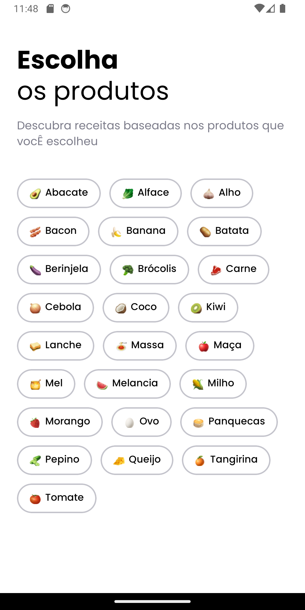
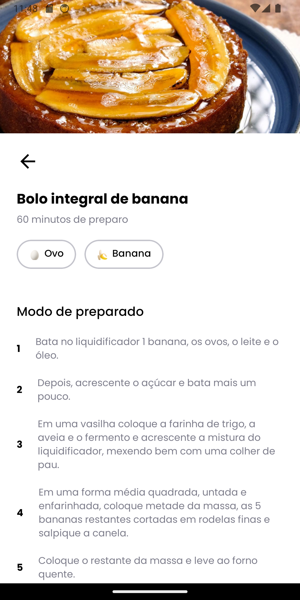

# Cook


**Cook** is the ultimate solution for those moments when you return home famished after a long day's work, only to realize you forgot to swing by the grocery store for your weekly haul. As you stand in front of your open fridge, contemplating dinner options with the limited ingredients on hand, Cook App swoops in to save the day. This project was developed as part of a hands-on session during the React Native in Practice event (Rocketseat), leveraging Expo for streamlined cross-platform development.

## Credits

This project was developed based on the knowledge acquired through courses and educational materials provided by [rocketseat](https://www.rocketseat.com.br). Rockseat offers a wide range of high-quality courses and content for developers in various areas, including design, programming, and app development.

We would like to thank the Rockseat team for providing valuable educational resources that contributed to the development of this project.

For more information about the courses and materials offered by Rockseat, please visit the official website at [rocketseat](https://www.rocketseat.com.br).

🎨 [Figma do projeto](https://www.figma.com/community/file/1346604268107725445)

## Technology

The following are the key technologies and tools used in the development of this app:

- **React Native**: It's a mobile app development framework that allows you to build native apps for iOS and Android using JavaScript and React. It enables mobile app development with a single codebase, providing a native user experience.
- **Expo**: It's an open-source platform and set of tools for building native mobile apps using JavaScript and React Native. Expo provides a range of ready-to-use components and APIs that streamline app development, including access to features like camera, geolocation, and push notifications.
- **Expo Router**: The Expo router is not a standalone library or module, but rather a part of the Expo SDK that facilitates navigation between screens in React Native apps built with Expo. It provides a simplified and declarative way to manage navigation within an app, allowing developers to define routes and navigate between them using components like StackNavigator, TabNavigator, and DrawerNavigator.
- **Supabase**: is an open-source alternative to Firebase that provides a suite of tools and services for building scalable and secure applications. It offers a real-time database, authentication, file storage, and serverless functions, all powered by PostgreSQL. With Supabase, developers can quickly set up and manage backend infrastructure without the need for complex configurations or maintenance. It's designed to seamlessly integrate with frontend frameworks like React Native, enabling developers to build full-stack applications with ease.
- **React Native Reanimated**: is a library for React Native that enables high-performance animations and interactions by leveraging the power of the native thread. Traditional animations in React Native are limited by the JavaScript thread, which can lead to stuttering or laggy animations, especially in complex scenarios. React Native Reanimated solves this problem by offloading animations and gestures to the native thread, resulting in smoother and more responsive user experiences. It provides a declarative API for defining animations and gestures, making it easy for developers to create complex interactions with minimal overhead. React Native Reanimated is widely used in production applications to deliver fluid and engaging user interfaces.

## How It Works

**Cook** is innovative app revolutionizes the way you explore and create delicious dishes. With Cook App, you have access to a diverse range of ingredients, allowing you to mix and match to your heart's content. Simply select multiple ingredients, and watch as the app generates a variety of possible dishes based on your chosen combinations.

### Home

The home screen presents a vibrant selection of ingredients for users to mix and match. With a simple scroll, users can explore diverse culinary options. The "Find" button at the bottom allows users to discover recipes tailored to their selected ingredients, streamlining their cooking experience.

### Recipes

The recipes screen, users see their selected ingredients followed by clickable images of potential dishes. Clicking on an image redirects users to the detailed recipe, streamlining their exploration.

### Recipe Details

The recipe details, users find a clear, step-by-step guide to crafting the selected dish. From ingredients to techniques, each detail is carefully laid out for easy follow-through, ensuring a seamless cooking experience.

## Screenshots

### Home




### Recipes


### Recipe Details



## Installation

To run the app locally, follow these steps:

1. Clone the repository:

   ```bash
   git clone https://github.com/edsoncamargo/rocketseat.git
   cd your-path/rocketseat
   ```

2. Install the dependencies:

   ```bash
   npm install
   ```

3. Start the app:

   ```bash
   npx expo start
   ```

4. Scan the QR code using the Expo Go app on your mobile device or use an emulator to test the app.

## Contribution

You are welcome to contribute to the development of this project. If you find bugs, wish to add new features, or improve usability, feel free to open an issue or submit a pull request.

## Contact

- Name: Edson Camargo Menezes
- Email: contact@edsoncamargo.dev

## Acknowledgments

Special thanks to everyone who contributed to making this app a reality, especially Rocketseat for their invaluable support and guidance throughout the development process. Your expertise and dedication have been instrumental in bringing this project to fruition.

Enjoy using **Cook App!**
